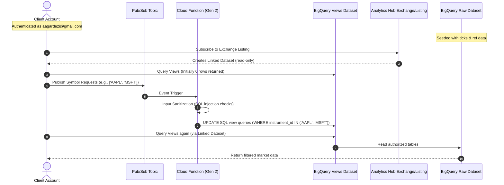

# BigQuery Sharing (Analytics Hub) Dynamic Tick-Data Exchange

This project implements a dynamic, event-driven equities tick data sharing solution using BigQuery Analytics Hub (formerly BQ Sharing), Pub/Sub, Cloud Functions (Gen 2), and Terraform.

It simulates a data provider hosting raw equities tick and reference data across multiple stock exchanges (LSE, NYSE, NASDAQ, Turquoise) and sharing that data with customers through custom views. The views are dynamically updated in real-time when the subscriber publishes their requested list of instruments to a Pub/Sub topic.

## System Architecture



---

## Directory Structure
```text
.
├── client/
│   ├── subscribe.py         # Subscribes client project to listing
│   ├── publish_request.py   # Publishes requested instrument IDs to Pub/Sub
│   └── query_data.py        # Queries customer linked views in BigQuery
├── provider/
│   ├── cloud_function/      # Source code for view-updater function
│   │   ├── main.py          # CF entry point (sanitizes & updates view definitions)
│   │   └── requirements.txt
│   ├── populate_data.py     # Seeds raw tables with mock tick-history and ref data
│   └── delete_exchange.py   # Utility to delete Analytics Hub listings & exchanges
├── scripts/
│   ├── setup_provider.sh    # Script to deploy provider resources & seed mock data
│   ├── test_client.sh       # Script to simulate subscription & trigger dynamic view updates
│   └── teardown.sh          # Script to cleanly delete all resources
└── terraform/               # Modular infrastructure declarations (BQ, CF, IAM, Pub/Sub)
```

---

## Prerequisites

1. **GCP Accounts/Projects**:
   - **Provider Project**: GCP project where the raw exchange data is hosted (Default: `genaillentsearch`). Active terminal credentials must have owner or editor role access to this project.
   - **Client Project**: Simulated external customer GCP project (Default: `cleanroomdemo-471909`).
2. **Terminal Requirements**:
   - `gcloud` SDK installed and configured.
   - `terraform` v1.3+ installed.
   - Python 3.11+ installed.
   - `uv` Python package installer (run `curl -LsSf https://astral.sh/uv/install.sh | sh` to install).

---

## Walkthrough: Deploy & Run Demo

We have packaged the entire deployment, verification, and teardown flows into three simple executable scripts under the `scripts/` folder.

### Step 0: Authenticate Your Environment
Before running the setup or client scripts, ensure your gcloud session is authenticated with the correct GCP account and project.

**For Provider Actions (Step 1)**:
Authenticate as the provider user (`aagardezi@sgardezi.altostrat.com`) and set the provider project:
```bash
gcloud auth login aagardezi@sgardezi.altostrat.com
gcloud config set project genaillentsearch
gcloud auth application-default login
```

**For Client Actions (Step 2)**:
Switch to the client user account (`aagardezi@gmail.com`) and set the client project:
```bash
gcloud auth login aagardezi@gmail.com
gcloud config set project cleanroomdemo-471909
gcloud auth application-default login
```

---

### Step 1: Deploy Provider Side & Seed Data
Initialize Terraform, deploy all provider-side GCP resources (datasets, views, Pub/Sub, Cloud Function, Exchange/Listing), and seed the raw tables with simulated market data.
Run this using the provider credentials:
```bash
./scripts/setup_provider.sh <provider_project_id>
```
*If project ID is omitted, it defaults to `genaillentsearch`.*

### Step 2: Run Client Subscription & Verify Updates
Simulate the customer subscribing to the listing, querying the views (initially empty), publishing a request for specific symbols, waiting for the update, and verifying that the views now return only the requested records.
Run this using the client credentials:
```bash
./scripts/test_client.sh <provider_project> <client_project> <client_dataset> "<instruments>"
```
**Example**:
```bash
./scripts/test_client.sh genaillentsearch cleanroomdemo-471909 shared_equities_views "VOD AAPL JPM"
```
*If omitted, defaults are:*
- *Provider Project: `genaillentsearch`*
- *Client Project: `cleanroomdemo-471909`*
- *Client Dataset: `shared_equities_views`*
- *Instruments: `VOD AAPL JPM`*

### Step 3: Tear Down Resources
Cleanly remove all provisioned GCP resources from both provider and client projects, preventing any ongoing billing charges:
```bash
./scripts/teardown.sh <provider_project> <client_project> <client_dataset>
```

---

## Key Technical Decisions & Highlights

- **Dependency Order Resolution**: Explicit `depends_on` constraints were configured in `terraform/bigquery.tf` between the view definitions and the raw tables. This prevents transient `404 Table not found` errors when Terraform attempts to create views before BigQuery has fully registered the raw base tables.
- **Streaming Buffer Avoidance**: The population script (`provider/populate_data.py`) was optimized to use **BigQuery Load Jobs** (`WRITE_TRUNCATE` disposition) instead of streaming inserts (`insert_rows_json`). This completely avoids BigQuery streaming buffer locks, allowing immediate subsequent updates or deletes of the tables during developer iterations.
- **SQL Injection Prevention**: The Cloud Function sanitizes instrument IDs from incoming Pub/Sub JSON messages by filtering out any characters that are not alphanumeric or expected symbols (`.`, `-`, `/`), ensuring the dynamic SQL query updates are safe.
- **Local Testing Simulation**: A subscriber IAM member for the provider session identity (`aagardezi@sgardezi.altostrat.com`) is provisioned by default in Terraform. This allows testing the listing subscription and data querying locally within the provider project if an external client project is not available.
