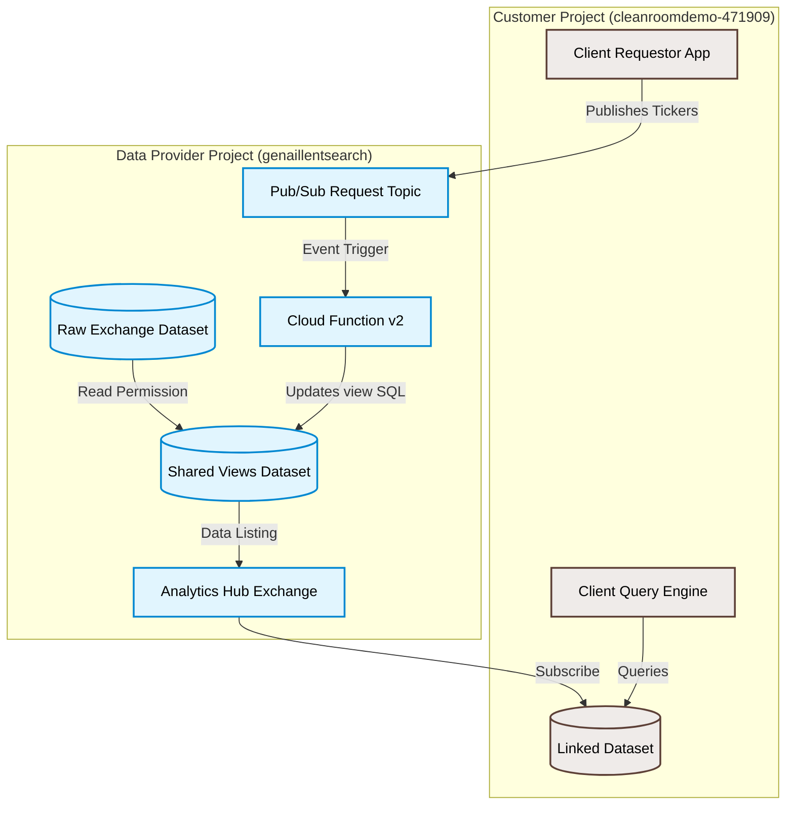
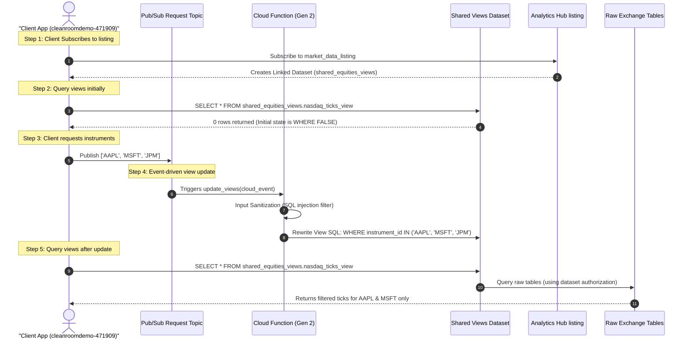

# Scaling Financial Market Data Sharing: Dynamic View Orchestration on BigQuery Analytics Hub

Financial institutions and market data providers, such as the London Stock Exchange Group (LSEG), manage vast repositories of historical tick data. Traditionally, distributing these massive datasets to buy-side clients (e.g., quant hedge funds, investment banks) involved expensive, slow, and operationally complex processes: file-based SFTP deliveries, bespoke REST APIs, or physical database replication.

With Google Cloud’s **BigQuery Analytics Hub**, providers can share data in place without copying it. However, a major challenge remains: **Data Entitlement**. Market data is licensed strictly by instrument (ticker) subsets. Sharing an entire exchange dataset exposes unlicensed tickers, while creating separate physical datasets or views for every single client permutation is a maintenance nightmare.

This blog post explores an event-driven, zero-copy architecture that dynamically filters and entitlements shared BigQuery datasets in real-time based on client-requested instrument lists, using BigQuery Analytics Hub, Pub/Sub, and Cloud Functions.

---

## The Challenge: Granular Entitlement at Scale

Consider a data provider like LSEG offering tick-history data for multiple global exchanges (LSE, NYSE, NASDAQ, Turquoise). A quantitative fund wants to subscribe to this feed but only licenses data for a specific, changing subset of instruments (e.g., `AAPL`, `MSFT`, `JPM`, and `VOD`). 

### The Bad Approaches:
1. **Data Duplication**: Copying selected tick data to a separate client-specific dataset. This incurs massive storage replication costs and breaks the "zero-copy" paradigm.
2. **Static View Per Client**: Manually creating and maintaining thousands of customer-specific views. This does not scale and creates huge administrative overhead.

### The Modern Approach: Dynamic View Filtering
The provider shares a single dataset containing *custom views* of the raw data. Initially, these views return 0 records (`WHERE FALSE`). When a customer updates their licensed instrument list (e.g., via a Pub/Sub topic published within the shared exchange), a lightweight Cloud Function dynamically rewrites the underlying SQL definition of the views to filter by the new instrument list. BigQuery Analytics Hub automatically propagates the updated query logic to the customer's linked dataset—instantly, securely, and with zero data replication.

---

## High-Level Architecture

The architecture relies on separate GCP project boundaries representing the Data Provider (e.g., LSEG) and the Data Subscriber (the Client).



---

## Detailed E2E User Workflows



---

## Detailed User Stories

### 1. Data Provider Operational Story (LSEG Market Data Ops)
> **As an** LSEG Market Data Operations Engineer,
> **I want to** publish our global equities datasets on Analytics Hub and allow client-driven filtering via Pub/Sub,
> **So that** I don't have to manually provision and modify datasets, views, or IAM permissions every time a client adds or removes tickers from their subscription.
>
> **Acceptance Criteria**:
> - The raw tick-history database must remain isolated and inaccessible directly by the client.
> - The client must only access data through a shared views dataset, authorized to read from the raw dataset.
> - Views must default to returning `0 rows` until a valid requested list of tickers is received.
> - View query rewrites must be automated, instantaneous, and sanitized against SQL injection.

### 2. Data Subscriber Operational Story (Buy-Side Quantitative Analyst)
> **As a** Quantitative Research Engineer,
> **I want to** dynamically change the stock tickers I am analyzing and query their historical tick records directly in my local BigQuery workspace,
> **So that** I can backtest new trading strategies on-demand without managing external data pipelines, SFTP downloads, or local storage.
>
> **Acceptance Criteria**:
> - I can subscribe to the LSEG listing and access it as a read-only dataset inside my local project.
> - I can request an updated list of symbols by publishing a JSON payload to the provider's Pub/Sub topic.
> - Within seconds of publishing the request, queries run against my linked dataset must reflect the updated ticker list.

---

## Deep Dive: Core Engineering Decisions

### 1. BigQuery Authorized Datasets (Zero-Copy Entitlement)
To share views without sharing the underlying raw tables, the provider configures **Authorized Datasets**. The `shared_customer_views` dataset is explicitly authorized to query the `raw_exchange_data` dataset. When the customer queries their linked dataset:
- BigQuery validates that the customer has permission to read the view.
- BigQuery delegates authorization to the raw tables because the view's parent dataset is authorized on the raw dataset.
- The customer *never* gets direct read access to the raw data, preserving database security.

### 2. Avoiding BigQuery Streaming Buffer Locks
When populating the raw datasets with simulated exchange data, standard streaming APIs (`insert_rows_json`) put the target table into a temporary "streaming buffer" write-lock state. During this lock period, any attempt to run DML statements (`DELETE`, `UPDATE`, or table updates) on the table fails.
**Resolution**: The population script uses **BigQuery Load Jobs** with `WRITE_TRUNCATE` disposition. This writes data in a single transactional file batch, bypassing the streaming buffer entirely and enabling continuous resets during development/testing.

### 3. SQL Injection Sanitization
Because the Cloud Function dynamically interpolates ticker symbols into the view's SQL query string (`WHERE instrument_id IN ("AAPL", "MSFT")`), it is vulnerable to SQL injection. A malicious client could send a payload designed to break out of the string literal and extract unauthorized data.
**Resolution**: The Cloud Function runs strict character sanitization on the input list, stripping out anything that is not alphanumeric or standard ticker symbols (`.`, `-`, `/`):
```python
safe_instruments = []
for inst in instruments:
    sanitized = "".join(c for c in str(inst) if c.isalnum() or c in [".", "-", "/"])
    if sanitized:
        safe_instruments.append(sanitized)
```

---

## Benefits for Market Data Providers (LSEG Case Study)

Applying this architecture to a provider like LSEG offers major advantages:

1. **Storage Optimization**: Storage costs are reduced to $0 for customer distribution. Data is queried in place, and only one copy of the global tick history is maintained.
2. **Instant Delivery**: Subscription modifications (adding/removing tickers) take effect in seconds, rather than requiring next-day SFTP batch runs.
3. **Automated Governance**: Entitlements are handled programmatically through Pub/Sub messaging. The provider's operations team does not need to intervene to process subscription changes.
4. **Billing Offloading**: The client pays for the compute costs (query scan bytes) of their backtesting and analysis, while LSEG only pays for the storage of the master database.

---

## Summary
By combining the zero-copy sharing power of **BigQuery Analytics Hub** with event-driven **Cloud Functions**, financial institutions can completely reinvent how they package, entitle, and distribute high-velocity market data. The resulting platform is secure, cost-efficient, and runs at scale.
